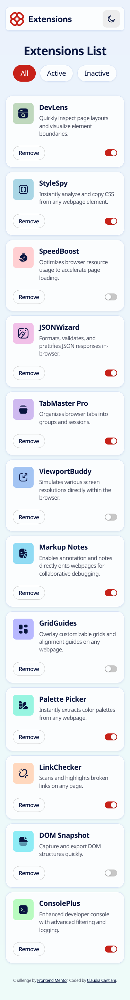
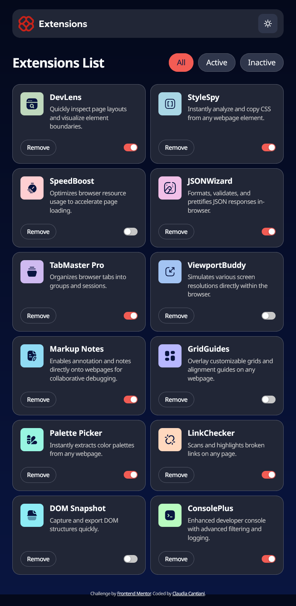

# Frontend Mentor - Browser extensions manager UI solution

This is a solution to the [Browser extensions manager UI challenge on Frontend Mentor](https://www.frontendmentor.io/challenges/browser-extension-manager-ui-yNZnOfsMAp). Frontend Mentor challenges help you improve your coding skills by building realistic projects.

## Table of contents

- [Overview](#overview)
  - [The challenge](#the-challenge)
  - [Screenshot](#screenshot)
  - [Links](#links)
- [My process](#my-process)
  - [Built with](#built-with)
  - [What I learned](#what-i-learned)
  - [Continued development](#continued-development)
- [Author](#author)

## Overview

### The challenge

Users should be able to:

- Toggle extensions between active and inactive states
- Filter active and inactive extensions
- Remove extensions from the list
- Select their color theme
- View the optimal layout for the interface depending on their device's screen size
- See hover and focus states for all interactive elements on the page

### Screenshot

### Links

- Solution URL: [Solution URL](https://your-solution-url.com)
- Live Site URL: [Live site URL](https://your-live-site-url.com)

## My process

### Built with

- Semantic HTML5 markup
- CSS custom properties
- Flexbox
- CSS Grid
- Mobile-first workflow
- SASS - primarly for the partials
- Vanilla JS

### What I learned

It was my first project with a theme switch, I used localStorage to save and read the preferred theme.
For the main.js, I used the Fetch API to retrieve the data from the JSON file.
I splitted the logic in various function and used event delegation for the button inserted with the fetched data. So I didn't have to worry if they were still null during the page load.

### Continued development

To manage the state, I'll probably try and use React the next time.

## Author

- Website - [Claudia Cantiani](https://cla91.github.io/)
- Frontend Mentor - [@cla91](https://www.frontendmentor.io/profile/cla91)
- Github - [@cla91](https://github.com/cla91)
